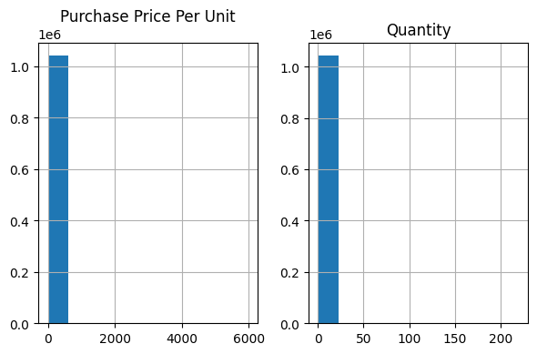
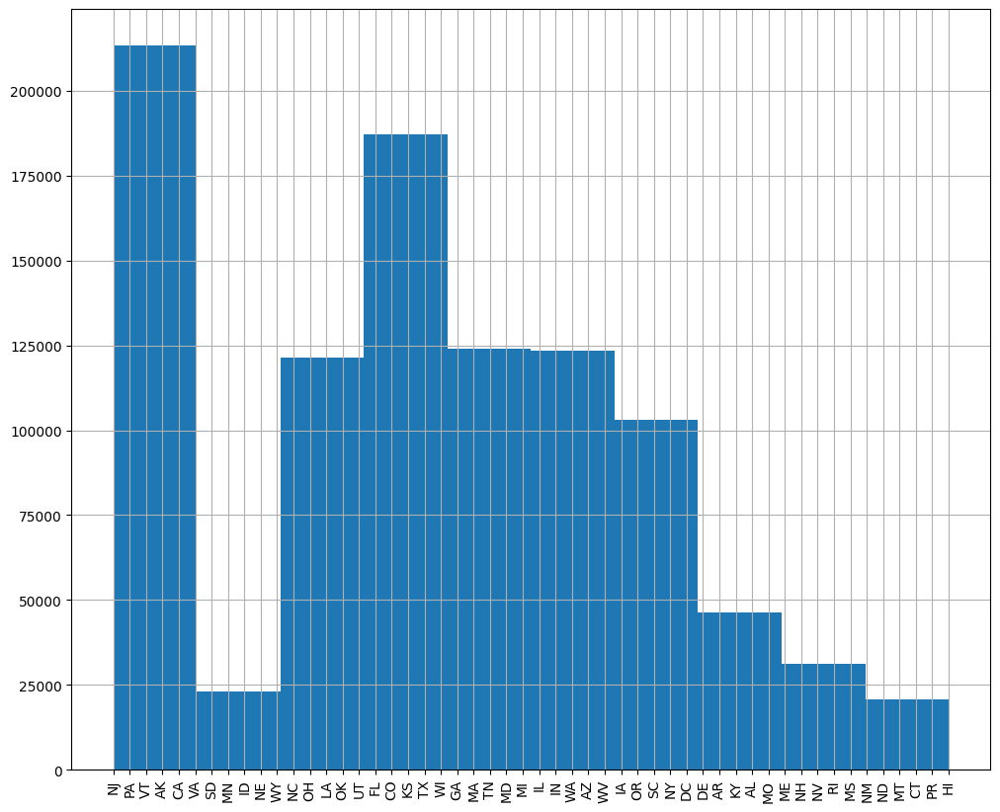
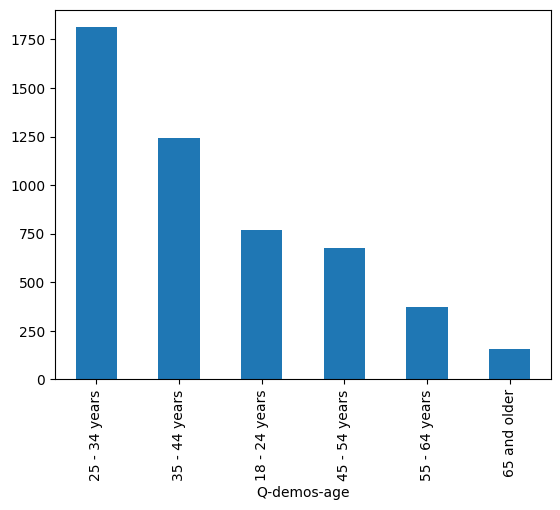
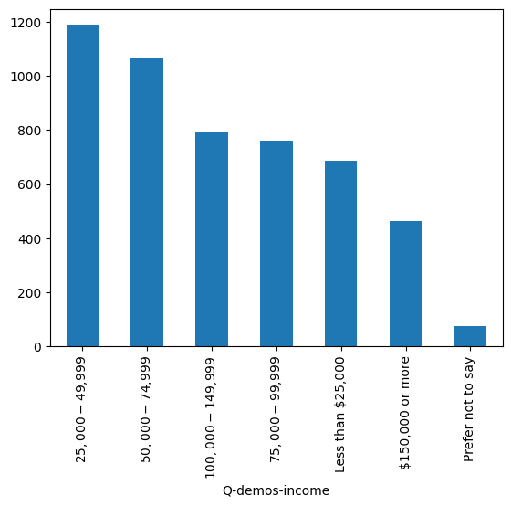
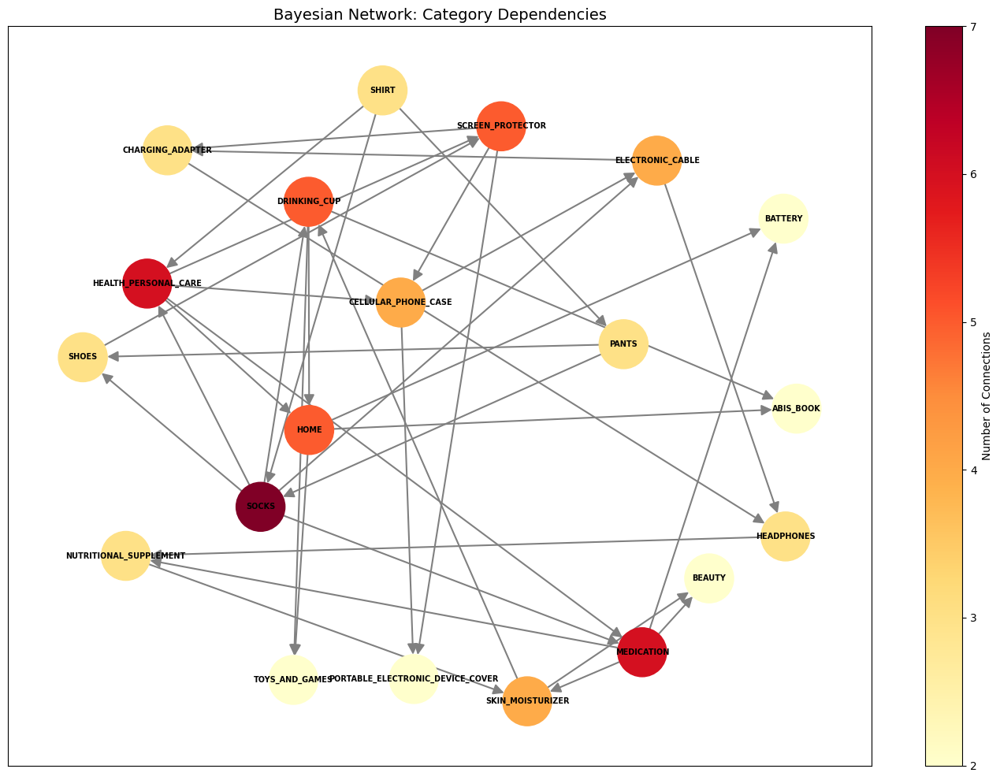
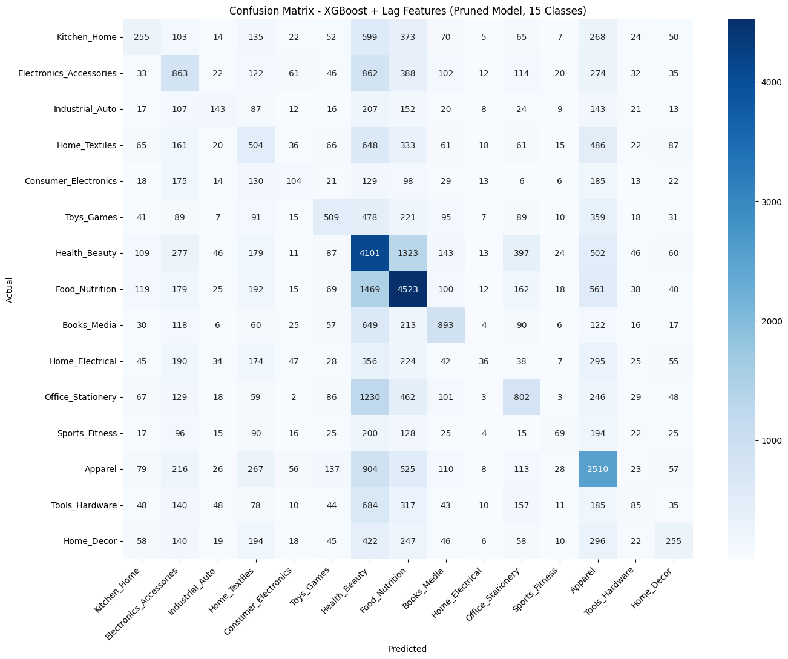
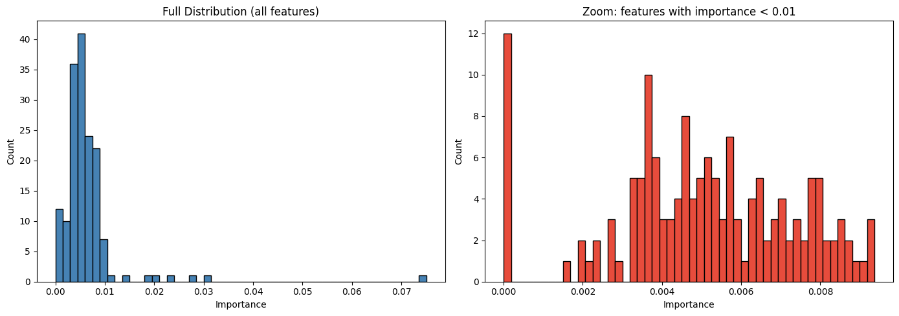
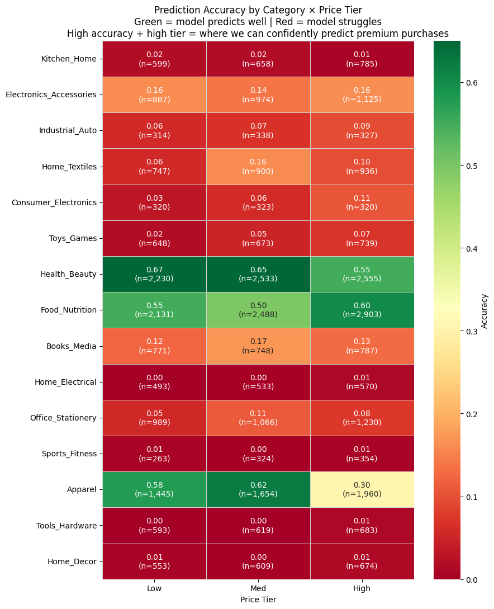
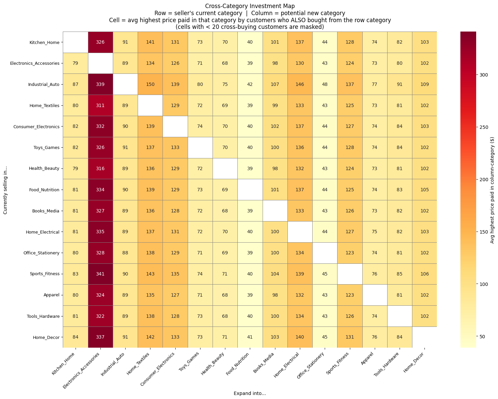

### Title: Predicting Future Amazon Purchases Using Demographics and Purchase Histories

### Team
1.	Name: Alexa Lotano - POC  
    GitHub ID: alexa-lotano
2.	Name: Shahaan Khan - POC  
    GitHub ID: ShahaanK
3.	Name: Ben Euto - POC  
    GitHub ID: bene01-git

### Introduction
Our project aims to examine customer behavior when it comes to e-commerce websites, mainly Amazon. Amazon is the world's biggest online retailer, with millions of active users worldwide and billions of monthly visits. Understanding and being able to predict purchase behavior introduces an opportunity for targeted recommendations that users are likely to actually purchase, benefitting both customers, Amazon executives, and sellers alike. 

**What are we trying to do?** 
Our goal is to build a system that uses current Amazon customer activity to predict future Amazon customer activity. For example, if a user purchases from one product category, would we expect them to repurchase from that same category? If not, can we predict which category they will purchase from next? We plan to do this by examining a combination of user demographics and purchase characteristics such as price, quantity, shipping state, and more.

**Primary Stakeholder Needs** 
This project aims to address the needs of the following stakeholders:
1.	Amazon Executives: Amazon needs a way to create reliable targeted recommendations that will actually promote purchases on the platform. Additionally, poor recommendations can lead to unfavorable perceptions of the company.
2.	Customers: The wide selection of products offered on Amazon can introduce decision fatigue and lead to endless searching for the right products.
3.	Sellers: With so many companies selling their products on Amazon, it can be difficult for sellers to target the right customers who are likely to purchase their products.

**Our Solution** 
Our final solution implements an XGBoost model to predict the category of a purchase based on both characteristics of that purchase and the customer’s demographics. Using previous purchases to understand what product characteristics customers gravitate towards, our model can be used to predict what other product categories a customer might purchase. This information can then be used to create personalized recommendations for users, with the goal of alleviating decision fatigue and providing a better shopping experience for customers, as well as boosting sales on the Amazon platform. Additionally, improved recommendations can help sellers reach the customers who are likely to actually purchase their products.

### Literature Review
Previous approaches in analyzing consumer behavior in the e-commerce industry are rooted in machine learning techniques used to understand and create personalized recommendations based on user behavior, preferences and historical interactions[^1]. These algorithms use data from entire customer-bases to determine and recommend items frequently bought by users with similar buying patterns. Such algorithms utilize machine learning techniques including neural networks, classification, Naïve Bayes, decision trees, logistic regression, and clustering to analyze buying patterns and create accurate recommendations[^1] [^2]. Beyond analyzing buying patterns, previous research also includes sentiment analysis based on customer reviews of products, uncovering opinions of consumers and providing insight into future purchase or repurchase patterns[^2].

Limited research has been performed to understand the impact of demographics on e-commerce buying patterns. Al-Otaibi (2024) employed deep learning models to predict whether a customer is likely or not likely to buy an item based on age and income, in addition to buying patterns[^3]. However, Al-Otaibi (2024) suggested that the use of additional demographic information could provide deeper insights into what drives consumer purchase patterns, allowing for more accurate personalized recommendations[^3]

Limitations of current research and recommendations exist, particularly regarding the lack of demographic analysis in current systems. Demographics play a large role in user behavior, making it difficult for systems that lack such data to target niche groups. The result is a system that is too general to accurately predict user needs and distracts users with suggestions that do not fit their needs and desires. Incorporating demographic analysis into recommendations is vital to improving consumer engagement with e-commerce platforms and recommendations.

Expanding on previous research, we intend to test a variety of both previously explored methods, such as neural networks, as well as new techniques such as ensemble methods, including XGBoost and Random Forest models. We acknowledge the novelty of existing approaches, and hope that the additional demographic features in our data will allow us to improve on existing methods and models.

**Stakeholder Needs:** 
*Amazon Executives*: Personalized recommendations can help Amazon increase sales, engagement, and conversion rates by simplifying the consumer experience. Additionally, platform personalization can contribute to favorable opinions about the company.

*Consumers*: The primary motivations for the use of e-commerce are convenience and wide product selections. However, the wide range of products available can make it difficult for users to quickly find the items they need. Creating the most accurate recommendations possible for individual users can alleviate decision fatigue and endless searching for the right products.

*Sellers*: Third party sellers will benefit from our system as their products will be promoted to the customers who are most likely to purchase their products.

### Data and Methods

#### Data
The dataset used contains 5 years’ worth of crowdsourced Amazon purchase histories and their user demographics, spanning from 2018 to 2022. 

DOI: 10.7910/DVN/YGLYDY

The dataset contains information regarding participants' past Amazon purchases, as well as demographic and personal information. Data was collected from 5,027 unique survey participants and contains approximately 1,050,000 Amazon purchases from 2018–2022.

All data was collected from consenting Amazon users and does not contain any uniquely identifiable information about participants. 

Multiple CSV files were included:

*amazon-purchases.csv*
- Details about the Amazon orders themselves, including the order date, state the shipping address is located in, purchase price, quantity of product purchased, product name, and category product can be found in among other values
- Includes a column named SurveyResponsesID (randomly generated at the time of collection) which links the user's survey response to their Amazon purchase

*survey.csv*
- Survey responses including only responses from users who willingly chose to participate and share their data
- Also includes the SurveyResponseID column as a link with amazon-purchases.csv

*fields.csv*
- Names and descriptions of columns in survey.csv
- Fields/survey columns correspond to survey questions

Limitations of crowdsourced data: Because participants self-selected into the survey, the dataset may not be perfectly representative of all Amazon users. We note this as a limitation but believe the dataset is sufficiently large and diverse for our modeling purposes.

Due to the extremely large file sizes, we sampled 800 survey responses and analyzed only the Amazon purchases linked to these survey respondents. After cleaning and transforming the dataset, our data represents 157,026 rows and 156 features. The target variable, product category, contains 1,625 unique values. The class distribution is highly imbalanced: the most frequent category (ABIS_BOOK) accounts for over 83% of individual item support in association analysis, and after consolidation into 15 parent groups, the largest class (Health_Beauty) represents 17.6% of purchases while the smallest (Industrial_Auto) represents 2.1%, a roughly 8:1 imbalance between the largest and smallest classes.

The figures below provide an overview of key characteristics of the dataset.

*Figure 1: Distribution of numeric purchase features. Purchase Price Per Unit is heavily right-skewed, with most purchases under $50 and a long tail of high-value items.*

*Figure 2: Purchase counts by US shipping state. California, Texas, and Florida account for the largest share of purchases, consistent with their population sizes.*

*Figure 3: Age distribution of survey respondents. The 25-34 age group is the most represented, with declining counts toward older age groups.*

*Figure 4: Income distribution of survey respondents. The most common income bracket is $25,000-$49,999, indicating a predominantly middle-income sample.*

The chart below displays a Bayesian network of category dependencies, showing which product categories are frequently purchased by the same customers.

This data came from the Harvard Dataverse, which is Harvard University's research data repository. Harvard University is renowned for their research output, and they are consistently ranked the #1 research university in world each year, including this past year[^5]. This data also only consists of those who consented to participate in the survey, ensuring ethical collection that does not invade anyone's private data. With all of this in mind, we believe this is legitimate and credible data that will be of great use for our analysis.

#### Methods

**Preprocessing** 
We began by cleaning and transforming data to prepare it for modeling. This process included:
1.	*Data Integration and Subsetting*: We joined amazon-purchases.csv with survey.csv using the SurveyResponseID field to create a singular dataset combining purchase behavior with demographic attributes. We then subsetted the data to only include purchases for a random selection of 800 survey participants to mitigate future memory and storage constraints.
2.	*Temporal Feature Engineering*: Order dates were parsed into day, month, and year variables.
3.	*Categorical Encoding*: Potential target variables, including product categories, titles, and ASIN/ISBN codes, were encoded using a label encoder. Remaining categorical variables were encoded using one-hot encoding, with one dummy variable from each variable removed to avoid redundancy.
4.	*Handling Missing Data*: Missing data was imputed when possible. This included mapping titles to their ASIN/ISBN code and using these mappings to fill in missing titles, as well as imputing “None” for missing survey data (i.e., when data was missing for respondents’ life changes, we assumed this meant there were no life changes to note). Remaining rows with missing data that could not be reliably imputed were subsequently removed from the dataset.
5.	*Train/Test Split with Temporal Ordering*: Since we are using temporal data, we used all data from before 2021 as our training data, and all data from 2021 onwards as our test data, as opposed to a traditional 80/20 split. This was done to preserve the temporal nature of our data and prevent data leakage.

While modeling, we performed additional data cleaning and transformation steps as needed for specific modeling attempts. These steps included additional temporal feature engineering and sequence construction, as well as grouping product categories. These steps will be described in relation to the modeling techniques they were implemented for in the following section.

**Modeling Techniques** 
After exploring, cleaning, and preprocessing our data, we used numerous modeling techniques to understand patterns in the data and build a prediction model. Of our three possible target variables, we decided to attempt to predict only product categories. This is because ASIN/ISBN codes and product titles simply had too many unique values. We found that categories grouped products effectively enough that predicting categories would provide meaningful insight into possible recommendations for users. The goal of our recommendation model is to provide users with a few products that they may want to purchase based on their purchase history and demographics, not necessarily to predict their exact next purchase.

Our initial modeling techniques included:
1.	*Dimensionality Reduction and KNN Classification*: Our first attempt at modeling our data consisted of dimensionality reduction and subsequent K-nearest neighbor classification. We attempted a few different dimensionality reduction techniques, including Principal Component Analysis (PCA), Factor Analysis, and UMAP. Using PCA, we were able to capture 95 percent of variance in our data using 93 factors. Factor analysis was assessed using a KMO model, which indicated that it was unsuitable for our dataset. UMAP was attempted with 2 components. We then performed KNN classification on both the PCA and UMAP reduced datasets, as well as the original dataset. We found that the PCA reduced data was classified more accurately than the UMAP reduced data, but both reduction methods led to significantly worse classification results than the original data. Thus, we abandoned dimensionality reduction methods, and moved forward with our original dataset.
2.	*Association Rule Mining*: Due to poor classification results in our KNN classification model, we decided to try association rule mining to get a better understanding of the data and items that are frequently purchased by the same customer based on survey response ID. It is important to note that this method required us to use only survey response ID and the categories, so it does not give us a comprehensive understanding of the impact of demographics on purchase behavior, or other factors such as purchase price, quantity, order date, or sequential features such as time between orders. This model served merely to give us a better understanding of relationships between product categories, and which categories are often purchased by the same customers.
3.	*Bayesian Rule Mining*: We additionally performed Bayesian rule mining to evaluate and refine discovered rules about customer purchasing behavior across product categories. We read in an unencoded copy of the dataset to facilitate the process, computed Bayesian-adjusted confidence scores using Laplace smoothing, and calculated the Kemeny–Oppenheim confirmation measure to quantify the strength of evidence for each rule. We then  used pgmpy's Hill Climb search with BIC scoring to develop a Bayesian Network structure over frequent product categories, fit the network's parameters to display conditional probability tables (CPTs), visualized the directed dependency graph with NetworkX, surfaced the top rules filtered based on their Kemeny–Oppenheim measures, and added a category connectivity bar chart showing in-degree and out-degree per node. The resulting analysis and model identified category sets with high support and confidence grounded in both observed evidence and probabilistic priors, ultimately updating beliefs about which categories of items are commonly purchased together and verifying (or potentially disputing) earlier association rule mining findings to better inform cross-category customer recommendations.
4.	*Random Forest*: We trained a Random Forest classifier on a 10,000-row subsample of our dataset due to memory constraints. We used the same temporal train/test split as all other models (orders before 2021 for training, 2021 onward for testing). We performed hyperparameter tuning and analyzed feature importances to understand which features most influenced category predictions.
5.	*Neural Networks*:
    Next, we attempted various neural networks to predict categories. We began with a simple multilayer perceptron (MLP) with 2 hidden layers. We compiled the model using a loss function of sparse categorical cross entropy and an SGD optimizer, and using accuracy as our metric. We then attempted a wide and deep neural network, subsetting features so that the wide and deep components were trained on different features. This meant features that were likely linearly related to categories were used to train the wide component, and remaining features where interactions were likely present were used to train the deep component. At this point, we also examined the correlations between variables and removed some variables that were extremely highly correlated to other variables. We predicted that doing so would help mitigate memory constraints and simplify our models without sacrificing accuracy. Our wide and deep neural network performed significantly worse than our original MLP, so this was abandoned. We tested the MLP again after removing the highly correlated values to confirm that accuracy was not greatly impacted. 

    Next, we attempted to build a Long-Short Term Memory (LSTM) network. At this point, we conducted sequential feature engineering to create new variables in our dataset, allowing the LSTM to identify sequential patterns. These features included days since last purchase, and the position in the customers order sequence. We also kept the survey response ID variable when training the LSTM to ensure that different customers were being treated as such. Although the LSTM did not improve on the accuracy of our previous model, we tested our original MLP on the data with the new features, which resulted in a slight improvement.

    We attempted numerous hyperparameter combinations with our MLP, including number of layers, number of nodes per layer, activation functions, optimizers, and callbacks. We found that our best model was the MLP after removing highly correlated features and adding sequential and time-based features, with the original hyperparameters.
6.  *XGBoost*: We trained XGBoost classifiers mirroring the Random Forest setup at the 1,625-class level, then progressively refined the approach through category consolidation, class balancing, price-tier joint modeling, and temporal lag feature engineering. Each iteration is described in detail in the Results section below.

While predicting what category of product a user might purchase next, we began to find that the number of unique categories in our data was still much too large, with over 1,600 unique categories. This not only limited our ability to accurately predict purchase categories, but also introduced memory issues and slowed down our models significantly. To mitigate this, we attempted to collapse our categories into a smaller number of more general categories. We also created an additional feature to represent purchase price tier.

Once parent categories were identified, we ran our best neural network on the new category data. We also ran a random forest and an XGBoost model. Using accuracy and F1-score as our metrics, we identified XGBoost using the parent categories as our strongest model.

Typical Amazon customers do not disclose their demographic information. This means that in order to extrapolate our model beyond our dataset, we must be able to reliably predict customer demographics based on the data they do provide. That is, we must be able to predict demographics based on a customer’s purchase history. To do this, we built a multi-output neural network to predict each demographic feature in our dataset. We then confirmed that predictions for all demographic variables were more accurate than simply predicting the most common value of each. This network would allow us to use our model on typical Amazon users, not just users who voluntarily provide their demographic information.

**Evaluation Strategy** 
When evaluating our models, we examined both accuracy and F1-scores. Because our data is highly imbalanced, F1-score provides a better indication of performance than accuracy alone. Although some models exhibited promising accuracies, not all of these models resulted in as high of F1-scores. Our strongest model, XGBoost, exhibited a similar accuracy and F1-score on both training and testing data, indicating that it performed well even on unbalanced data.

#### Supporting files
Our supporting files located in the work folder are as follows:
1. *01-purchase-data-eda.ipynb*: Exploratory analysis of the Amazon purchase data
2. *02-survey-data-eda.ipynb*: Exploratory analysis of the Survey data.
3. *03-data-merge-and-cleaning.ipynb*: Merging of the Amazon purchases and survey data and initial cleaning (handling missing values, renaming variables, etc.).
4. *04-data-transformation.ipynb*: Transformation of merged data, including encoding and scaling.
5. *05-dimensionality-reduction-and-visualization.ipynb*: Using PCA, Factor Analysis, and UMAP to reduce dimensionality and visualizing reduced data.
6. *06-modeling.ipynb*: Initial modeling attempts using a K-Neighbors Classifier and comparing accuracy using original data and reduced data.
7. *07-association-rule-mining.ipynb*: Using Association Rule Mining to identify items frequently purchased by the same customers.
8. *08-bayesian-rule-mining.ipynb*: Using Bayesian Rule Mining to identify items frequently purchased by the same users and visualizing Bayesian networks.
9. *09-random-forest.ipynb*: Building a random forest model and analyzing feature importance.
    - *09-random-forest.py*: Code to build a random forest model from Azure instance.
10. *10-neural-networks.ipynb*: Building an MLP and Wide & Deep neural network to classify category labels.
11. *11-xgboost.ipynb*: Building an XGBoost classifier to classify category labels.
    - *11-xgboost.py*: Code to build an XGBoost classifier from Azure instance.
12. *12-lstm.ipynb*: Expanding on existing neural networks to create an LSTM network using sequential features
13. *13-neural-network-tuning.ipynb*: Additional hyperparameter tuning of neural networks.
14. *14-demographic-prediction.ipynb*: Building a prediction model to identify demographic features from purchase behavior.
15. *15-category-consolidation.ipynb*: Consolidating category labels into broader parent categories for improved classification.
16. *15-1-xgboost-consolidated-categories.ipynb*: XGBoost on 15 semantically consolidated categories; class-balanced variant; 45-class combined category x price tier model; cross-category investment analysis.
17. *15-2-xgboost-lagged-features.ipynb*: XGBoost with temporal lag features (previous category, recency, rolling purchase counts); importance-based feature pruning; price-tier stratified evaluation; sequential cross-category investment map. This notebook contains our best model.
18. *16-neural-networks-with-parent-categories.ipynb*: Re-running neural network on broader category labels.

### Results
Our modeling pipeline progressed through several stages, each informing the direction of subsequent attempts. All metrics were generated using a single temporal train/test split (orders before 2021 for training, 2021 onward for testing) rather than n-fold cross-validation. N-fold CV was not used because random shuffling would violate the temporal ordering of purchases and introduce data leakage, where future purchases could appear in the training fold.

**Dimensionality Reduction and KNN Classification** 
We ran PCA using 93 components, while UMAP was attempted with 2 components. KNN classification was then applied to the PCA-reduced, UMAP-reduced, and original datasets. The PCA-reduced KNN achieved approximately 1.5% accuracy, while the original unreduced dataset reached approximately 3.4%. Both dimensionality reduction approaches produced significantly worse results than the original, unreduced dataset. Factor analysis was also assessed using a Kaiser-Meyer-Olkin (KMO) test, which indicated that it was unsuitable for our data. With all of this in mind, dimensionality reduction was abandoned in favor of modeling on the original feature set.

**Association and Bayesian Rule Mining** 
Association rule mining was used to identify product categories frequently purchased by the same customer. While this method provided useful insight into co-purchase patterns, it was limited by the fact that it only leveraged survey response ID and product categories, excluding demographics, pricing, quantity, order dates, and sequential features. 

Bayesian rule mining extended these findings by computing Bayesian-adjusted confidence scores with Laplace smoothing and calculating Kemeny–Oppenheim confirmation measures. A Bayesian Network was constructed over frequent product categories using Hill Climb search with BIC scoring, producing conditional probability tables and a directed dependency graph. 

The resulting analysis identified category sets with high support and confidence, verifying and in some cases refining earlier association rule mining findings. The strongest rule identified was PANTS → SHIRT (support 0.508, confidence 0.896, lift 1.260, Kemeny-Oppenheim 0.555), and the Bayesian network confirmed that apparel categories (shirts, pants, socks, shoes) and electronics accessories (cables, chargers, headphones, phone cases) form two distinct high-association clusters within the purchase graph.

**Neural Networks** 
Our neural network consisted of a multilayer perceptron (MLP) with two hidden layers including sparse categorical cross-entropy loss and an SGD optimizer. Wide and deep neural networks were tested, with features split so that features with linear relationships trained the wide component and interaction-based features trained the deep component. This architecture performed significantly worse than the original MLP and was abandoned. An LSTM network was also tested after engineering sequential features, including days since last purchase and order sequence position. While the LSTM itself did not outperform the MLP, incorporating the newly engineered sequential and time-based features into the MLP yielded a slightly improved accuracy. After extensive hyperparameter tuning across number of layers, nodes per layer, activation functions, optimizers, and callbacks, our best performing neural network remained the MLP trained on the dataset with highly correlated features removed and sequential and time-based features added using its original hyperparameters. This model achieved 7.04% test accuracy (11.5% training accuracy) across 1,625 categories. The LSTM achieved 5.77% test accuracy. Due to the large number of target classes, F1 scores at this granularity are not meaningful; the first useful F1 comparisons appear with the Random Forest and XGBoost results below.

**Category Consolidation** 
A persistent challenge across all models was the high number of unique product categories (each exceeding 1,600). This granularity not only limited predictive accuracy but also introduced memory constraints and substantially slowed model training. To address this, we used sentence-transformer embeddings to semantically cluster the 1,625 categories into 15 broader parent groups, and all subsequent models were trained on this consolidated target. This single change produced the largest accuracy gain of the entire project. Among the models evaluated on the consolidated target, XGBoost substantially outperformed the MLP, confirming that tree-based methods are better suited to this tabular prediction task.

**Neural Networks Using Parent Categories** 
Re-running our MLP on the 15-class consolidated target yielded 23.2% test accuracy (weighted F1 0.1301). To address class imbalance, we applied SMOTE oversampling to the training set and retrained the model. The SMOTE variant collapsed predictions entirely to a single class (Home_Decor), achieving only 4.2% accuracy and a weighted F1 of 0.0034, worse than the unweighted baseline. Both variants are substantially outperformed by XGBoost on the same 15-class target, confirming that tree-based methods are better suited to this tabular dataset than an SGD-trained MLP. Full per-class TP/TN/FP/FN metrics and confusion matrices are in notebook 16.

**Random Forest** 
Trained on a 10,000-row subsample due to memory constraints, the Random Forest achieved 7.28% test accuracy across all 1,625 categories. Among the top 20 most frequent categories, F1 Macro was 0.0126 and F1 Weighted 0.0536, performance comparable to the neural network baselines and consistent with the difficulty of a 1,625-class problem on a subsample. The most important feature was Purchase Price Per Unit (importance 0.2549), followed by order year and order month, confirming that temporal and price signals dominate over demographic features at this class granularity. Per-class TP/TN/FP/FN for the top 20 categories and a confusion matrix heatmap are in notebook 09; the full 1,625-class breakdown is too large to report here.

**XGBoost** 
XGBoost was applied across several progressively refined configurations, representing the main arc of model development.

*Baseline (1,625 classes, 10K subsample):* Matching the RF setup, XGBoost achieved 7.78% test accuracy, F1 Macro 0.0118, F1 Weighted 0.0475, a marginal improvement over Random Forest at the same class granularity. Both models confirm that 1,625 categories is too fine-grained for reliable prediction on this dataset.

*Category consolidation to 15 classes (full 157K rows):* Using sentence-transformer embeddings to semantically cluster the 1,625 categories into 15 parent groups (notebook 15), and retraining XGBoost on the full dataset with GPU acceleration, accuracy jumped to **29.5%** (F1 Macro 0.1465, F1 Weighted 0.2365), a gain of +21.7 percentage points. This was the single largest improvement across the entire project. A class-balanced variant using `scale_pos_weight` traded overall accuracy (23.1%) for better minority-class recall (F1 Macro 0.1841, +0.0376 vs unweighted), which may be preferable for recommendation systems that need coverage across all categories. A 45-class joint model combining category and price tier achieved 9.9% accuracy (F1 Macro 0.0439), confirming that predicting category and price tier simultaneously is a harder problem, though it provides richer output for targeting high-value purchases.

*Temporal lag features (best model, notebook 15-2):* Augmenting the 15-class feature set with six lagged purchase features per customer: previous parent category, previous price tier, days since last purchase, and rolling purchase counts at 1-, 6-, and 12-month windows, pushed accuracy to **36.2%** (F1 Macro 0.2530) on the full feature set, and **36.1%** (F1 Macro 0.2545, F1 Weighted 0.3328) after importance-based pruning to 85 features (threshold ≥ 0.005). The pruned model nearly matches the full model while using just over half the features. The top feature by importance was `prev_parent_category` (0.1053), confirming that the most recent purchase category is the strongest single predictor of the next one.

*Figure 5: Confusion matrix for the pruned XGBoost + lag features model (36.1% accuracy). Food_Nutrition and Health_Beauty show the strongest diagonal signal, while smaller categories such as Home_Electrical and Sports_Fitness are frequently misclassified into the larger classes.*

*Figure 6: Top feature importances for the pruned XGBoost + lag features model. prev_parent_category ranks first (importance 0.1053), followed by order year and purchase price per unit. Demographic features appear lower in the ranking, confirming that sequential purchase behavior carries more signal than customer attributes.*

*Price-tier stratification:* Both the 15-class model and the lagged model were evaluated separately by price tier (Low / Medium / High, tertile-split within category). In the lagged pruned model, Low and Medium tier accuracy were nearly equal at 37.1%, while High tier was 34.3%, consistently 2-3 percentage points lower across both models. High-value purchases are marginally harder to predict, likely reflecting greater variety in premium spending.

*Figure 7: Prediction accuracy by category and price tier (Low / Medium / High) for the 15-class XGBoost model (notebook 15-1). Green cells indicate strong per-class accuracy; red cells indicate poor accuracy. Health_Beauty, Food_Nutrition, and Apparel are consistently the most predictable categories across all price tiers, while Home_Electrical, Sports_Fitness, and Tools_Hardware are the hardest to classify.*

*Cross-model feature importance:* Purchase Price Per Unit is the dominant feature in both the RF and the 1,625-class XGBoost. Once temporal lag features are introduced, `prev_parent_category` takes the top position, outweighing all demographic and price features. This shift illustrates that sequential purchase behavior carries more signal than any single transaction attribute.

The full summary of results across all models and configurations is shown below.

| Model | Accuracy | F1 Macro | F1 Weighted | Data |
|---|---|---|---|---|
| Random Forest | 7.28% | 0.0126 | 0.0536 | 10K subsample, 1,625 classes |
| Neural Net MLP | ~7.04% | N/A | N/A | 10K subsample, 1,625 classes |
| LSTM | ~5.77% | N/A | N/A | Sequential features, 1,625 classes |
| XGBoost | 7.78% | 0.0118 | 0.0475 | 10K subsample, 1,625 classes |
| NN parent categories | 23.2% | 0.0054 | 0.0034 | Full data, 15 classes |
| XGBoost 15-class | 29.5% | 0.1465 | 0.2365 | Full data, 15 classes |
| XGBoost 15-class balanced | 23.1% | 0.1841 | 0.2432 | Full data, 15 classes |
| XGBoost 45-class (cat × tier) | 9.9% | 0.0439 | 0.0730 | Full data, 45 classes |
| **XGBoost + lags, pruned (best)** | **36.1%** | **0.2545** | **0.3328** | Full data, 15 classes, 85 features |

Confusion matrices and per-class TP/TN/FP/FN tables are in notebooks 09 (RF), 11 (XGBoost 1,625-class), 15-1 (15-class and 45-class), 15-2 (lag features), and 16 (NN parent categories).

### Discussion
Our results tell a clear progression story. Starting from a 1,625-category prediction problem where all models plateaued near 7-8% accuracy, two interventions produced the meaningful gains: category consolidation and temporal lag features. Collapsing 1,625 fine-grained categories into 15 semantically meaningful parent groups was the single largest lever, adding +21.7 percentage points to XGBoost accuracy. Adding lagged temporal features added another +6.6 points, bringing our best model to 36.1% on a 15-class problem. Together these two steps account for nearly all the improvement over the baselines.

The dominance of temporal features is the most important finding. Before lag features, Purchase Price Per Unit was the top predictor across both Random Forest and XGBoost. After introducing `prev_parent_category`, it immediately became the top feature by a wide margin. This confirms that what a customer bought most recently is a stronger signal than any demographic attribute or price characteristic. Demographic features, while present in the model, contributed less than expected: the model still outperforms a naive baseline, but the performance gap between models with and without demographics is small compared to the gap introduced by sequential features.

Neural networks underperformed tree-based methods throughout. The MLP reached 7.04% on 1,625 classes, and even on the 15-class consolidated target it achieved only 23.2%, well below XGBoost at 29.5% on the same data. Class collapse in notebook 16 (the model predicting a single class for all inputs) illustrates a key limitation of SGD-trained MLPs on imbalanced tabular data: without SMOTE or class weighting, the model takes the path of least resistance. SMOTE made the collapse worse. This is consistent with the broader literature showing that gradient-boosted trees tend to outperform deep networks on structured tabular data, particularly under class imbalance.

With respect to stakeholder needs: a 36.1% accuracy on 15 categories is meaningful for a recommendation system. A system does not need to predict the single correct category to be useful; surfacing two or three high-probability categories already narrows a customer's browsing considerably. The cross-category investment map (notebooks 15-1 and 15-2) directly serves the Sellers stakeholder by identifying which category pairs have the highest revenue potential for cross-promotion. The map below shows the average highest price paid in adjacent categories by cross-buying customers.

*Figure 8: Cross-category investment map (notebook 15-1). Each cell shows the average highest price a customer paid in the column category, given that they also purchased from the row category. Darker cells indicate higher cross-category spend, highlighting the most valuable cross-promotion opportunities for sellers.* The price-tier finding (high-value items are 2-3 points harder to predict) is relevant to Amazon Executives targeting high-LTV customers, suggesting that a separate submodel or loss weighting for premium purchases could be valuable. Finally, the demographic prediction network in notebook 14 addresses a practical deployment constraint: since typical Amazon users do not share survey demographics, predicted demographics can substitute for observed ones, extending the model beyond the survey sample.

The three suggestions made by our professor were all implemented: semantic clustering of categories (notebook 15), price-tier feature engineering (notebook 15-1), and temporal lag features (notebook 15-2). Each contributed measurable improvement.

### Limitations
Several limitations should be considered when interpreting our findings. Firstly, because participants voluntarily chose to share their Amazon purchase histories, the sample may not be fully representative of the broader Amazon customer base; certain demographics or purchasing behaviors may be over- or under-represented relative to the general population of Amazon users. Another limitation arose because we subsetted the data to 800 randomly selected survey respondents, yielding 157,026 purchases (the full dataset has almost 1,000,000 purchases across around 5,000 participants). While this sample is still substantial, reducing the dataset may have excluded patterns or demographic groups present in the full data. The granularity of our product categories also posed a significant challenge as well. With over 1,600 unique categories, models struggled with both predictive accuracy and computational efficiency. Although we attempted to mitigate this through category consolidation, the mapping of fine-grained categories to broader parent categories inevitably involves some loss of specificity and may introduce ambiguity in how products are grouped. Another limitation comes with the fact that the dataset consists solely of pre-2021 data, which means the set is outdated and may not reflect current shopping trends and patterns. It also may not reflect any significant events (i.e. America's 250th anniversary) that may influence these shopping patterns. Another limitation was the presence of missing data; handling it required several imputation decisions, such as assuming that absent life-change responses indicated no life changes. These assumptions, while reasonable, may not hold for all respondents and could introduce noise into the dataset. Certain modeling approaches were also limited in the features they could incorporate. Association rule mining, for example, relied solely on survey response ID and product categories, meaning it could not account for the influence of demographics, pricing, or temporal patterns on co-purchase behavior. Finally, our models predict product categories rather than specific products, which doesn't give too much insight for individual product suggestions. This trade-off, however, was necessary given the impracticality of predicting from tens of thousands of unique IDs or product titles.

### Future Work
The most targeted next step is improving recall on high-value purchases. Our price-tier analysis shows that High-tier items are consistently 2-3 percentage points harder to predict across both the 15-class and lag-feature models. A custom loss function that penalizes misclassification of high-value items more heavily, or a separate specialized submodel for premium categories like Consumer Electronics and Tools, could address this gap.

Applying the LSTM architecture to the 15-class consolidated target is a natural extension. Our LSTM was only evaluated on the original 1,625-category problem where the signal-to-noise ratio is low. With 15 consolidated classes and the same temporal sequence features used in notebook 15-2, an LSTM may be better positioned to learn sequential purchase dependencies than a stateless XGBoost model.

A two-stage deployment pipeline would make the system usable in production. The demographic prediction network in notebook 14 (predicting survey demographics from purchase history) would serve as the first stage, followed by the category prediction model as the second stage. This removes the requirement that users provide demographic survey responses, making the system applicable to any Amazon customer.

Scaling to the full survey dataset is also worthwhile. Our models were trained on purchases from 800 randomly selected survey respondents (157,026 rows). The full dataset contains approximately 1,000,000 purchases across 5,027 respondents. More respondents would improve coverage of rare categories and demographic segments, and may reveal patterns that the current subsample misses.

Finally, the dataset ends in 2022. Post-pandemic shifts in e-commerce behavior, inflation effects on purchasing patterns, and category mix changes since 2022 likely reduce the generalizability of the current model to present-day Amazon users. Incorporating more recent data would be essential before any production deployment.

References
[^1]: Raji, M. et al., "E-commerce and consumer behavior: A review of AI-powered personalization and market trends." 2024.  
[^2]: Gupta, K. et al., "E-Commerce Customer Behavior Using Machine Learning." 2024.  
[^3]: Al-Otaibi, Y., "Enhancing e-Commerce Strategies: A Deep Learning Framework for Customer Behavior Prediction." 2024.
[^4]: Aurélien Géron, "Hands-On Machine Learning with Scikit-Learn, Keras, and TensorFlow, Third Edition", 2022.
[^5]: Voronoi. (2025, July 17). Harvard University is the top research university of 2025. https://www.voronoiapp.com/education/Harvard-University-is-the-Top-Research-University-of-2025--5816
